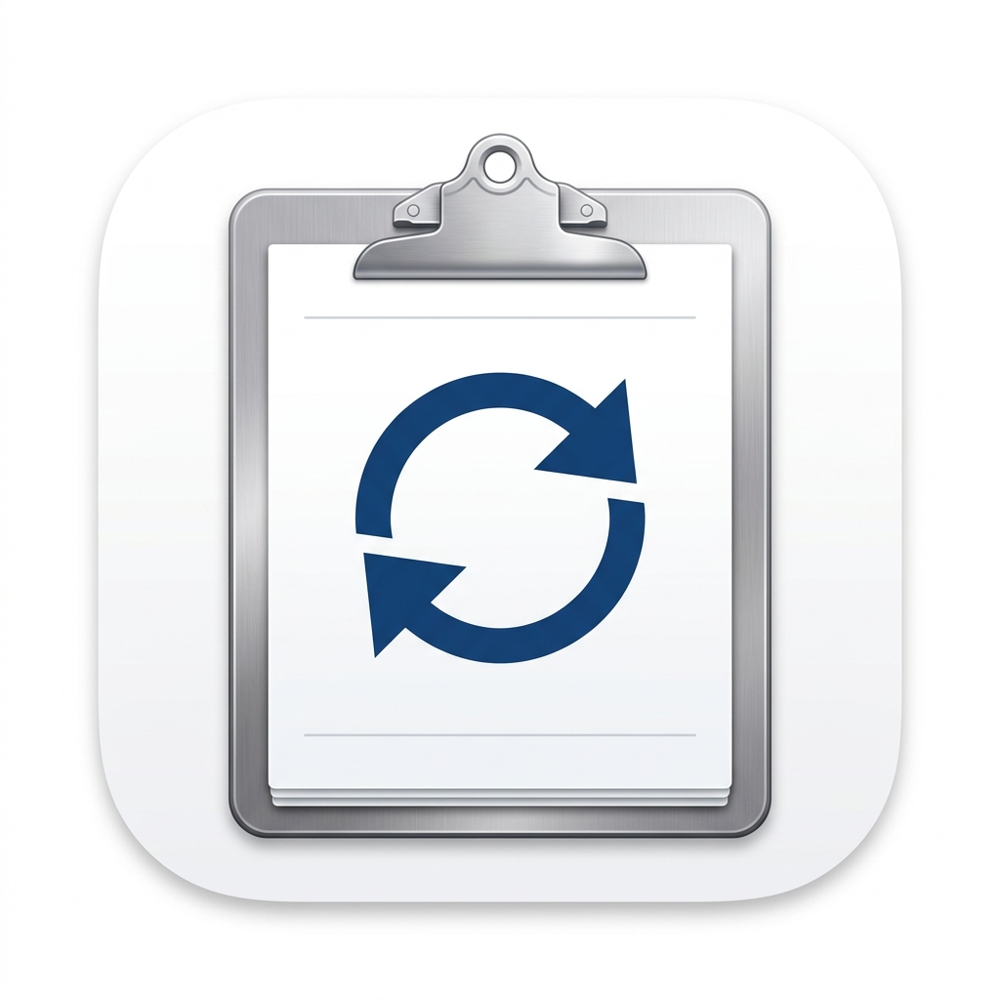

<div align="center">
  
  <h1>ClipRelay</h1>
  <p><strong>Local-first encrypted clipboard and file relay</strong></p>

  <div>
    
    
    
    
  </div>

  <br />

  ClipRelay syncs clipboard content and files between trusted devices on the local network or VPN, with encryption, history, and per-device trust controls.
</div>


## What is in this repository

- `cliprelay-core`: Rust engine, protocol, history, trust store, metrics, settings, file transfer, and IPC.
- `cliprelay-cli`: Command-line client for daemon control, history, templates, settings, and metrics.
- `platforms/linux`: Linux client/daemon built on the core.
- `platforms/macos`, `platforms/android`, `platforms/windows`: Native platform integrations that use the shared core.

The Cargo workspace currently builds `cliprelay-core`, `cliprelay-cli`, and `platforms/linux`.

## Current features

- Encrypted peer-to-peer sync over the local network using mDNS discovery and X25519 + ChaCha20-Poly1305.
- Timeline-first clipboard UX: incoming remote clipboard items land in the activity feed first, and the user applies them when ready.
- File transfer support with chunking, resumable transfer logic, and integrity verification.
- Activity history with search, pinning, tags, filters, stats, and CSV/JSON export.
- Trust management with TOFU pairing, device blocking, renaming, pause/resume, and per-peer overrides.
- Clipboard templates for frequently used text snippets.
- Sync controls for text, images, files, URL-only sync, payload limits, debounce, and rate limiting.
- Runtime metrics and peer health snapshots.

## Command-line usage

Start the daemon:

```bash
cargo run -p cliprelay-core --bin cliprelay-daemon
```

Inspect status and health:

```bash
cargo run -p cliprelay-cli -- status
cargo run -p cliprelay-cli -- ping
cargo run -p cliprelay-cli -- metrics
```

Work with history:

```bash
cargo run -p cliprelay-cli -- history --last 20
cargo run -p cliprelay-cli -- history export csv
cargo run -p cliprelay-cli -- history export json
cargo run -p cliprelay-cli -- history stats
cargo run -p cliprelay-cli -- history pin <id>
cargo run -p cliprelay-cli -- history tag <id> <tag>
```

Manage devices and templates:

```bash
cargo run -p cliprelay-cli -- devices list
cargo run -p cliprelay-cli -- devices trust <device-id>
cargo run -p cliprelay-cli -- devices peer-settings <device-id> pause
cargo run -p cliprelay-cli -- template list
cargo run -p cliprelay-cli -- template push <name>
```

See the full CLI surface with:

```bash
cargo run -p cliprelay-cli -- help
```

## Linux client

Run the Linux client or daemon wrapper:

```bash
cargo run -p cliprelay-linux
```

## Configuration and data files

ClipRelay stores its files in platform-specific config and data directories.

- Settings: `cliprelay/settings.json`
- Trust store: `cliprelay/trust.json`
- Peer store: `cliprelay/peers.json`
- History: `cliprelay/history.json`

On Linux and macOS the config path resolves through the platform config directory. On Windows it resolves through the user config directory.

## Limitations

- Devices must be on the same subnet or reachable through a VPN because discovery uses mDNS.
- iOS is not part of the current workspace.
- Android clipboard access is constrained by background execution rules on modern Android versions.

## Security model

- End-to-end encryption with X25519 key exchange and ChaCha20-Poly1305 for message protection.
- TOFU trust model for new devices, with device blocking and per-peer trust controls.
- Sensitive text filtering, ignore patterns, payload limits, and rate limiting to reduce accidental syncs.

## Building

```bash
cargo build --workspace
```

## Platform notes

- Open the macOS project under `platforms/macos` in Xcode.
- Open the Android project under `platforms/android` in Android Studio.
- Open the Windows project under `platforms/windows` in Visual Studio.

## Contributing

Contributions are welcome! Please see [CONTRIBUTING.md](CONTRIBUTING.md) for our engineering guidelines and code of conduct.


## License

This project is licensed under the **MIT License**. See [LICENSE](LICENSE) for details.
